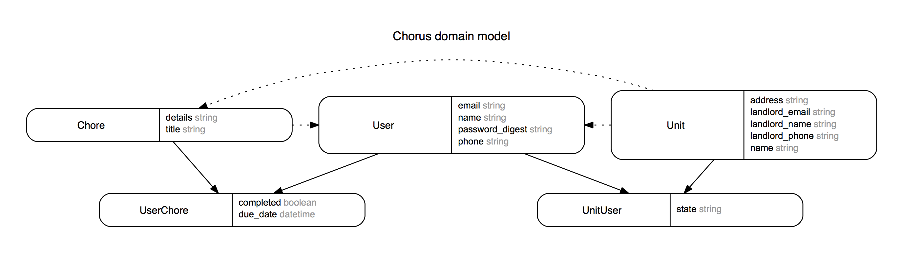

# Chorus

## Synopsis

This was for project two at General Assembly, a project built with Ruby on Rails. It is a chore tracking app for shared living spaces.

## Motivation

The initial idea for this project was to build an all in one apartment living suite, with the ability to track chores, pay rent and utilities, and report issues to the landlord. With the scope of the project lasting only one week, our group settled on chore tracking as it was the largest pain point of having roommates.

## Walk through

* A user will create an account then a unit or join an existing unit. (A demo account has been included.)
* A user that joins an existing apartment will be marked as pending and need to gain approval from an existing member of the unit.
* A user can view contact information, chores, and landlord information from the unit's main page.
* A user can create, update and and delete chores.
* A user can mark a chore as "Complete" or "Incomplete".
* A user can also update the due date of the chores.
* A user must not have any chores before leaving a unit.
* There is only a soft suspend process for a user to leave a unit so that he/she can join a separate unit in the future.

## Contributors

### Team Members

Ayush Jha, Nathan Lee, Andrea Ceballos, Arthur Tonelli

### Issue Tracking

Issues can be made and are tracked on Github [here](https://github.com/altonelli/chorus/issues).

## Installation

To contribute to the project, fork and clone the repository.
To clone from the command line:

'''
git clone https://github.com/altonelli/chorus.git
'''

This app uses several gems so once it is cloned, install the bundle

'''
bundle install
'''

## Entity Relationship Diagram

## Technologies

* Ruby on Rails
* PostgreSQL
* JQuery
* Turbolinks
* Sass
* Bootswatch
* Bootstrap
* Friendly_URL
* RSpec
* Heroku

## Tests

Describe and show how to run the tests with code examples.

